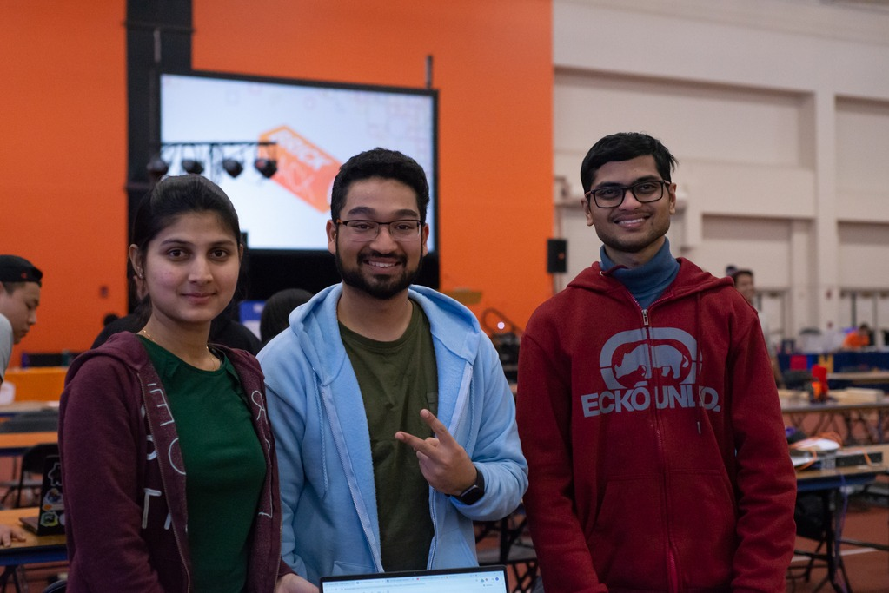
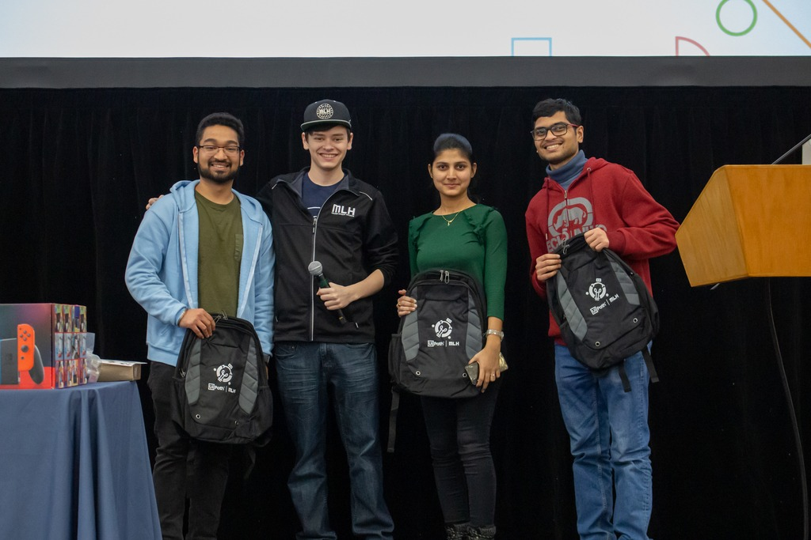

# Inspiration
This project has been a significant step in recognizing and harnessing the true potential of utilizing the google assistant to perform custom tasks. This idea magnifies the potential usage of the available resources like TRANSLOC API. Being part of the student community which uses RIT commute to travel on and off-campus, we noticed that the use of google assistant will make it more convenient and easy for focusing on just the route and the bus that we are interested in. Students can use this to better plan their schedules especially when bus services can be irregular like in winters. While developing this project, we kept in mind the overall object of Google Assistant that makes things simple and accessible.

# What We Learned
- To implement a custom Google Assistant Action from scratch
- To integrate an external API within the Google Actions
- Deploying on Google Actions directory.
- Planning, organizing, collaborating, and implementing a product within a limited time

# How We Built
- We created our Google developers account.
- Created and configured a new Action on Google Actions Console.
- Training and defining the conversation on Dialogflow.
- Fetching and parsing the RapidAPI's Transloc API.
- Identified and defined intents and entities on Dialogflow.
- Implementing inline code for Webhooks on Dialogflow.

# Challenges We Faced
- Issues with the Dialogflow and the follow-up intents as there were very few sources to get the knowledge base.
- No comprehensive documentation for Dialogflow.
- Minimal support from RapidAPI open source community
- We had to rely on the irregular real-time bus timings of the RIT shuttle in order to test our Action.

# Demo Time

# Won Best Automation Hack!

